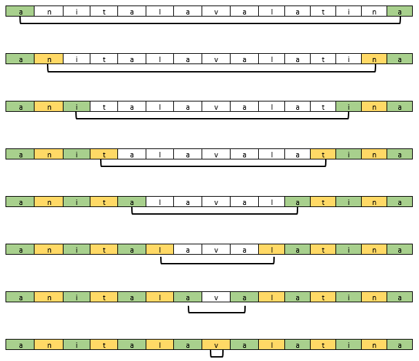

# Comprobacion para saber si una palabra es un Palindromo en F#

## Datos personales
* ___Nombre:___ Diana 
* ___Apellido:___ Rodríguez Espiricueta
* ___Especialidad:___ Ingenieria en Tecnologias de la Información (ITI)
* ___Nombre del profesor de la especialidad:___ Ibarra González Juan Carlos
* ___Nombre de la institución:___ Universidad Politecnica de San Luis Potosí
* ___Matrícula:___ 170010

## Descripción

En el siguiente codigo se intenta describir la propuesta se se propuso para resolver el problema que consitia en comprobar si cierta palabra era un palíndromo, en dicha 
propuesta se propone que la palabra ingresada se ingrese a una lista, posteriormente esta lista se ira validando mediante un for, en donde se comparara la primera 
y ultima letra, si son iguales, pasa a comparar las siguientes dos letras del arreglo y así hasta comparar todo el arreglo.

Ademas de que se validará que la palabra ingresada sea impar ya que los palíndromos se caracterizan por tener un número impar de letras, con una letra en el medio a la 
que se le llama "espejo palindrómico".

## Codigo

**_Encabezado del codigo_**

        // Comprobacion para saber si una palabra es un Palindromo en F#

        (* *****************************************************************************
        *  Nombre:  Diana
        *  Apellidos:  Rodríguez Espiricueta
        *  Especialidad:  ITI
        *  Profesor de la materia:  Juan Carlos González Ibarra
        *  Institución:  Universidad Politecnica de San Luis Potosí (UPSLP) 
        *  Matricula:  170010
        **************************************************************************** *)

**_La palabra se ingresa a un arreglo_**

        open System                                                     //  Abrimos el sistema

        let array = ResizeArray<char>()                                 //  Definicion del arreglo
        let palindromo = "anitalavalatina";                             //  Palindromo *se escribe todo junto

        let cadena = palindromo.ToCharArray();                          //  Se convierte el palindromo en un arreglo
        let tamaño = palindromo.Length;                                 //  Tamaño de la cadena/palindromo *es 15 en este ejemplo

        printf "\n %A" cadena                                           //  Imprimimos el polindromo 

**_Se obtiene la mitad del palindromo y se valida si es un palindromo por el numero de letras que tiene la palabra_**

        let mitad = tamaño/2                                            //  Mitad del arreglo *es 7 en este ejemplo

        let mutable cont = 0;                                           //  Contador que sirve para contar las coincidencias de letras

        if mitad*2 = tamaño then                                        //  Si la mitad del arreglo * 2 es igual al tamaño del arreglo *7x2 = 15
            printfn "\n NO ES UN PALINDROMO"                            //  No es un palindromo porque su tamaño es par
        else                                                            //  Sino
            printfn "\n La palabra ingresada puede ser un palindromo"   //  Puede ser palindromo porque su tamaño es impar
            printfn "\nComprobamos:"                                    //  Si su tamaño es impar, comprobamos si es o no palindromo

**_En caso de que la palabra tenga un numero impar de caracteres, se comprueba si es palindromo recorriendo la cadena y comparando caracteres_**

           //NOTA: El arreglo se lee de 0 a tamaño-1

            for i=0 to mitad do                                         //  Se recorre hasta la mitad del arreglo                        
                if(cadena.[i].Equals(cadena.[(tamaño-1)-i])) then       //  Si la primer posicion es igual a la ultima posición
                    cont <- cont + 1                                    //  Se aumenta el contador
                    printfn "posicion[%A] = %A <=> posicion[%A] = %A" i cadena.[i] ((tamaño-1)-i) cadena.[(tamaño-1)-i]   //Se imprimer las coincidencias de caracteres

            if cont = mitad+1 then                                      //  Si el numero de coincidencias de letras del arreglo es igual a la mitad del tam del arreglo
                printfn "\n ES UN PALINDROMO"                           //  Es un palindromo
            else                                                        //  Sino
                printfn "NO ES UN PALINDROMO"                           //  No es palindromo

## Problemas y soluciones
Tal vez, solo la unica problematica presentada fue la logica para determinar si era un palindromo o no

## Bibliografía 
Para realizar esta actividad se hizo uso de la siguiente bibliografia:

* Microsoft. 2020. F# | Functional Programming For .NET. [online] Available at: <https://dotnet.microsoft.com/languages/fsharp> [Accessed 23 October 2020].
