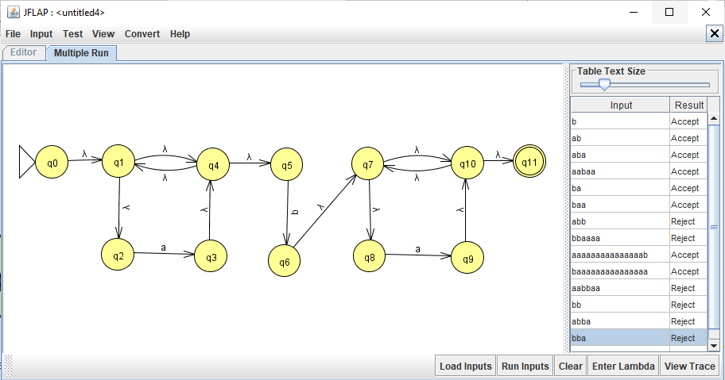
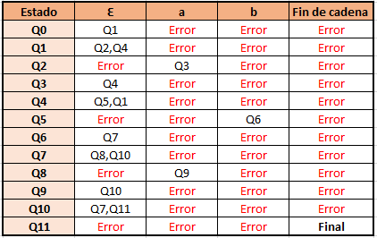

# Programa en F# Automata Finito No Deterministico (afnd)

## Datos personales
* ___Nombre:___ Diana 
* ___Apellido:___ Rodríguez Espiricueta
* ___Especialidad:___ Ingenieria en Tecnologias de la Información (ITI)
* ___Nombre del profesor de la especialidad:___ Ibarra González Juan Carlos
* ___Nombre de la institución:___ Universidad Politecnica de San Luis Potosí
* ___Matrícula:___ 170010

**Este programa se hizo en colaboracion con Julieta Rodríguez Espiricueta (180024)**

## Descripción

Un autómata finito no determinista (abreviado AFND) es un autómata finito que, a diferencia de los autómatas finitos deterministas (AFD), posee al menos un estado q ∈ Q, tal que para un símbolo a ∈ Σ del alfabeto, existe más de una transición δ(q,a) posible.

Por lo tanto, de acuerdo al concepto anterior en este programa se busca modificar el programa anterior que consistio en un autómata finito determinista a un autómata finito no determinista (AFND), en el cual se reciba cualquier cadena que cumpla con la siguiente expresión regular:
    
     a*ba*
     
El automata creado de esta expresión regular es el siguiente 

Y esta su tabla de transiciones

## Codigo

**_Encabezado del codigo_**

    //Creacion de un ejemplo de F# -> nfd
    (* *****************************************************************************
    *  Nombre:  Diana
    *  Apellidos:  Rodríguez Espiricueta
    *  Especialidad:  ITI
    *  Profesor de la materia:  Juan Carlos González Ibarra
    *  Institución:  Universidad Politecnica de San Luis Potosí (UPSLP) 
    *  Matricula:  170010

    ***Codigo eleborado con colaboracion de Julieta Rodríguez Espiricueta (180024)

    **************************************************************************** *)

**_Declaracion de variables_**

    //  Abrimos el sistema
    open System
    open System.Text.RegularExpressions 

    //  Declaracion de variables
    let mutable simbolo = " "
    let mutable Fin = " "

    //  Definición de la funcion caracter
    let caracter ( character ) : int = 
        simbolo <- " "
        Fin <- " "
        let a = "a"         // El alfabeto del automata es a y b 
        let b = "b"

**_Comparación/Validación de los caracteres ingresados_**

        //  Comparamos si es 'a' o 'b' 
        if Regex.IsMatch ( character, a ) then      // Si es una a, regresa un 0
            simbolo <- "    a   "
            0
        elif Regex.IsMatch ( character, b ) then    // Si es una a, regresa un 1
            simbolo <- "   b    "
            1
        elif character = Fin then                   // Si es "" , regresa un 2
            2
        else 
            printf "Error no es valido el caracter %A" character  // Si es un caracter no valido, regresa un 3 y se sale
            exit(3)

**_Impresion de valores y tabla_**

    (*---------------
    // IMPRESIONES // 
    ---------------*)
    let body()=
        printfn "+---------------+------------+----------------+------------------+" //Impresion se linea de división

    //  Funcion contenido, donde se guarda cada valor despues de encontrarlo en el ciclo
    let contenido ( estadosig, character, simbolo, estado ) =    
        printfn "|       %A       |    %A     |   %A   |        %A         |" estadosig character simbolo estado

        //  Solo muestra la linea que se repetira cada vez que la mandemos a llamar
        body()

    //  Definicion de la funcion del encabezado
    let encabezado() =
        printfn "|  Edo. Actual  |  Caracter  |    Simbolo     |  Edo. Siguiente  |"
        body()

**_Main y tabla de transiciones_**

    (*---------------
    //     MAIN    // 
    ---------------*)
    //  Tabla de transiciones del automata AFD creado 
    let tabla = [   //Estado    //Valores que acepta          //    Restricciones
    [  1;  5; 20 ];  //0             a|b                      // 1-11 -> Estados = Aceptacion    
    [  2;  5; 20 ];  //1             a|b                      // 20 -> Error
    [  3;  5; 20 ];  //2             a|b                      // 21 -> Vacio = Aceptacion 
    [  4;  5; 20 ];  //3             a|b
    [  1;  5; 20 ];  //4             a|b
    [  6; 20; 21 ];  //5             a|vacio
    [  7; 20; 21 ];  //6             a|vacio
    [  8; 20; 21 ];  //7             a|vacio
    [  9; 20; 21 ];  //8             a|vacio
    [ 10; 20; 21 ];  //9             a|vacio
    [ 11; 20; 21 ];  //10            a|vacio
    [  7; 20; 21 ]   //11            a|vacio
    ] 
    let mutable estado = 0

    printfn "         +------------------------------+ \n
             | Ingresa una cadena a evaluar | \n
             +------------------------------+"
    let caden = Console.ReadLine()
    let cadena = caden+" "
    body()
    encabezado()

**_Validaciones_**

    (*---------------
    // VALIDACIONES// 
    ---------------*)
    let mutable charcaracter = 0
    let mutable x = 0   //validar que no haya imprimido los primeros estados más de lo debido
    let mutable y = 5   //validar que no haya imprimido los ultimos estados más de lo debido
    let mutable b = 0   //valida que ya se haya imprimido la b

    //  Se recorre la cadena
    for character in cadena do
        let mutable estadosig = estado
        let mutable i = 0

        //  Llamamos al metodo para saber si es un caracter valido y el valor retornado se guarda en charcaracter 
        charcaracter <- caracter( string character )
        //  Guardamos en estado el valor obtenido en la tabla segun las coordenadas que recibio anteriormente
        estado <- tabla.[ estado ].[ charcaracter ]

        //  Si el valor de "a" es 4 y la b aun no ha sido impresa establece el estado como 4, que es donde se debe quedar
        if( x = 4 && b = 0 ) then     
            estadosig <- 4

        if(string character = "a" && x < 4) then     //lee cuantas a han sido impresas, hasta llegar a 4
            x <- ( x + 1 )
            contenido( estadosig, character, simbolo, estado )

        //  Si aun no imprime el numero maximo de a pero ya detecto que el esta siguiente es el 5, llena los espacios vacios
        if( x < 4 && estado = 5 )then                 
            for i in x .. 3 do
                contenido( i, " " , "        " , (i+1) )
            estadosig<-4

        //  Si detecta el caracter b, cambia el valor de las variables a b=1 y x=4, esto indica que esos lugares ya fueron llenados por letras a o por vacios
        if( string character = "b" )then
            b <- 1
            contenido( estadosig  , character, simbolo, estado )
            x <- 4

        //  Si detecta letras a, pero ya b ya fue impresa/detectada, ahora llenara los espacios que le siguen en la tabla
        if( string character = "a" && b = 1 && y <> 11)then 
            y <- ( y + 1 )
            contenido( estadosig, character, simbolo, estado )

        //  Si aun no tiene el numero maximo de a y detecta que el estado siguiente ya es el final, los llenara con vacios
        if( y < 11 && estado = 21 ) then   
            for i in y .. 10 do 
                contenido( i, " " , "        " , (i+1) )
            estadosig<-11

        //  Si el estado se establece en 20, es un error y lo imprime
        if( estado = 20 )then
            body()
            printfn "|                       Cadena No Valida                         |"
            printfn "+----------------------------------------------------------------+"
            exit(3)

    //  Al concluir si el estado no es 3 que es el de aceptacion imprimimos cadena no valida
    if( not ( estado.Equals( 21 ) ) ) then
        printfn "|                       Cadena No Valida                         |"
        printfn "+----------------------------------------------------------------+"

    //  Si el estado 3 es una cadena de aceptación
    if( estado.Equals( 21 ) ) then
        printfn "|       11      |            |                |    Fin Cadena    |"
        body()
        printfn "|                  Cadena  Valida                                |"
        printfn "+----------------------------------------------------------------+"

## Problemas y soluciones

En el automata establecido por el profesor de la materia, para la expresion regular ` a*ba* ` crea la siguiente tabla de transiciones:

Pero en el momento de codificar no se pueden emplear varios estados dentro de la transicion, por lo que se propuso esta nueva tabla de transiciones que siguiera cumpliendo las condiciones de la anterior, pero que se adaptara a las necesidades de la codificación: 
    
    //  Tabla de transiciones del automata AFD creado 
    let tabla = [   //Estado    //Valores que acepta          //    Restricciones
    [  1;  5; 20 ];  //0             a|b                      // 1-11 -> Estados = Aceptacion    
    [  2;  5; 20 ];  //1             a|b                      // 20 -> Error
    [  3;  5; 20 ];  //2             a|b                      // 21 -> Vacio = Aceptacion 
    [  4;  5; 20 ];  //3             a|b
    [  1;  5; 20 ];  //4             a|b
    [  6; 20; 21 ];  //5             a|vacio
    [  7; 20; 21 ];  //6             a|vacio
    [  8; 20; 21 ];  //7             a|vacio
    [  9; 20; 21 ];  //8             a|vacio
    [ 10; 20; 21 ];  //9             a|vacio
    [ 11; 20; 21 ];  //10            a|vacio
    [  7; 20; 21 ]   //11            a|vacio
    ] 

## Bibliografía 
Para realizar esta actividad se hizo uso de la siguiente bibliografia:

* Microsoft. 2020. F# | Functional Programming For .NET. [online] Available at: <https://dotnet.microsoft.com/languages/fsharp> [Accessed 14 October 2020].
