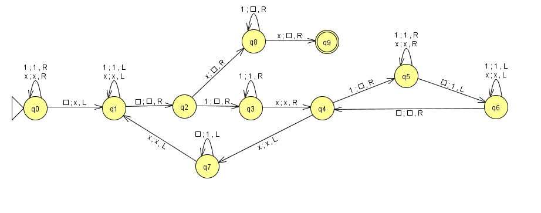

# Programa en F# Maquina de Turing - Multiplicacion 
## Datos personales
* ___Nombre:___ Diana 
* ___Apellido:___ Rodríguez Espiricueta
* ___Especialidad:___ Ingenieria en Tecnologias de la Información (ITI)
* ___Nombre del profesor de la especialidad:___ Ibarra González Juan Carlos
* ___Nombre de la institución:___ Universidad Politecnica de San Luis Potosí
* ___Matrícula:___ 170010

## Descripción

Una Máquina de Turing consta de una cinta infinita dividida en espacios de trabajo o celdas yuxtapuestas que actúa como memoria, un cabezal capaz de leer y escribir 
símbolos en la cinta y moverla de celda en celda a derecha e izquierda, un registro de estado, y una tabla finita de instrucciones o tabla de acción.

La maquina de turing tiene las caracteristicas de un Automata finito
    Q = Es un conjunto de estados
    Σ = Alfabeto conjunto de caracteres (codigo utf-8 ="\u03A3")	
    Γ = Simbolos de la cinta
    s = Estado inicial sϵQ
    δ= Reglas nde transicion 
    QxΣ->Q Reglas de transicion
    bϵΓ = es un simbolo denominado blanco, que se puede repetir 
          infinitamente en toda la cinta 
    F⊆Q Estado finales o de aceptacion
     
La Máquina de Turing creada se basa en el siguiente automata 

## Codigo

**_Declaracion del lenguaje y las variables_**

    open System                                                                 // Inicio del sistema 

    exception OuterError of string                                              // Declaracion de la excepción

    //Lenguaje de ma maquina se compone de: 
    //estados, simbolo blanco del alfabeto-cinta, reglas de transicion, cinta final, estado final, posicion siguiente de la MT
    let turing_M ( state ) ( blank ) ( rules:list<list<string>> ) ( tape:list<string> ) ( final ) ( pos ) =

    let mutable st = state                                                  // Declaracion de variables globales/mutables                                       
    let mutable tape = tape
    let mutable pos = pos
    let mutable Break = false
    let mutable NoCinta = true
    let mutable True = true

**_Funcionamiento de MT_**
   
    if ( tape.IsEmpty ) then
        tape <- [blank]

    if ( pos < 0 ) then
        pos <- pos + tape.Length

    if ( pos >= tape.Length || pos < 0 ) then
        raise ( OuterError ( "Se inicializa mal la posicion" ) )

    while not (Break) do                     
        printf (" %s ") st
        for i in 0..tape.Length-1 do
            if ( i = pos ) then
                printf (" [%s] ") tape.[i]
            else
                printf (" %s ") tape.[i]
        printfn ("")

        if ( st = final ) then
            Break <- true

        for character in rules do
            if ( st = character.[0] && tape.[pos] = character.[1] ) then
                NoCinta <- false
        if ( NoCinta ) then
            Break <- true
        if ( not Break ) then
            let mutable v1, dr, s1 = "", "", ""                                // Auxiliares para las variables

            for character in rules do
                if ( st = character.[0] && tape.[pos] = character.[1] ) then
                    v1 <- character.[2]
                    dr <- character.[3]
                    s1 <- character.[4]

            let mutable nuevaCinta = []

            for x in 0..tape.Length-1 do                                       //   Realiza la sustitucion en la cinta
                if ( x = pos ) then
                    nuevaCinta <- nuevaCinta @ [v1]
                else
                    nuevaCinta <- nuevaCinta @ [tape.[x]]
            tape <- nuevaCinta

            if ( dr.Equals("left") ) then                                       // movimiento del cabezal
                if (pos > 0) then
                    pos <- pos - 1
                else
                    tape <- [blank] @ tape
            if ( dr.Equals("right") ) then
                pos <- pos + 1
                if ( pos >= tape.Length ) then
                    tape <- tape @ [blank]
            st <- s1

**_Transiciones_**
        
        printf("MAQUINA DE TURING TEST MULTIPLICACIÓN \n")

        let main =
            // Se puede cambiar las reglasde transicion para otra maquina de turing
            let reglas =  [["s0"; "1"; "1"; "right"; "s0"];                              // Transiciones del estado 0
                      ["s0"; "x"; "x"; "right"; "s0"];
                      ["s0"; "b"; "x"; "left";  "s1"];

                      ["s1"; "1"; "1"; "left";  "s1"];                              // Transiciones del estado 1
                      ["s1"; "x"; "x"; "left";  "s1"];
                      ["s1"; "b"; "b"; "right"; "s2"];

                      ["s2"; "1"; "b"; "right"; "s3"];                              // Transiciones del estado 2
                      ["s2"; "x"; "b"; "right"; "s8"];

                      ["s3"; "1"; "1"; "right"; "s3"];                              // Transiciones del estado 3
                      ["s3"; "x"; "x"; "right"; "s4"];

                      ["s4"; "1"; "b"; "right"; "s5"];                              // Transiciones del estado 4
                      ["s4"; "x"; "x"; "left";  "s7"];

                      ["s5"; "1"; "1"; "right"; "s5"];                              // Transiciones del estado 5
                      ["s5"; "x"; "x"; "right"; "s5"];
                      ["s5"; "b"; "1"; "left";  "s6"];

                      ["s6"; "1"; "1"; "left";  "s6"];                              // Transiciones del estado 6
                      ["s6"; "x"; "x"; "left";  "s6"];
                      ["s6"; "b"; "b"; "right"; "s4"];

                      ["s7"; "b"; "1"; "left"; "s7"];                               // Transiciones del estado 7
                      ["s7"; "x"; "x"; "left"; "s1"];

                      ["s8"; "1"; "b"; "right"; "s8"];                              // Transiciones del estado 9
                      ["s8"; "x"; "b"; "right"; "s9"];]

            turing_M ("s0") ("b") (reglas) (["1";"1";"1";"x";"1";"1";]) ("s9") (0)       // Gramatica/reglas de la maquina de turing
            0

## Problemas y soluciones

Se tuvieron complicaciones al momento de usar el diccionario para la maquina de Turing, ademas de que se tuvo que implementar un break mutable, ya que si no, el codigo no 
funcionaba de la manera correcta. 

## Bibliografía 
Para realizar esta actividad se hizo uso de la siguiente bibliografia:

* Microsoft. 2020. F# | Functional Programming For .NET. [online] Available at: <https://dotnet.microsoft.com/languages/fsharp> [Accessed 29 de noviembre 2020].